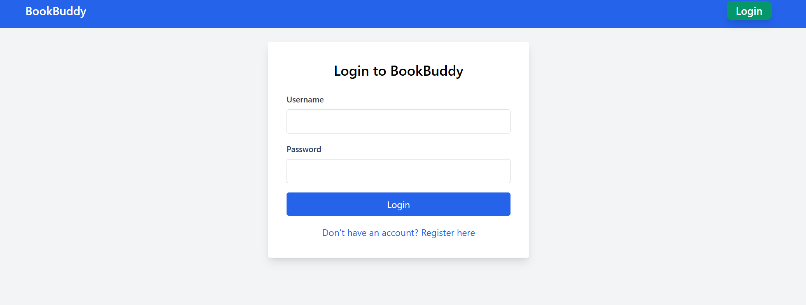
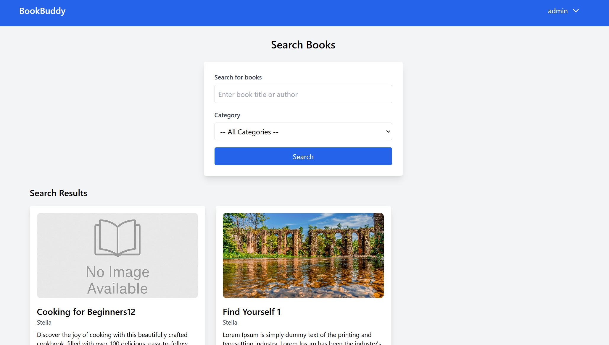
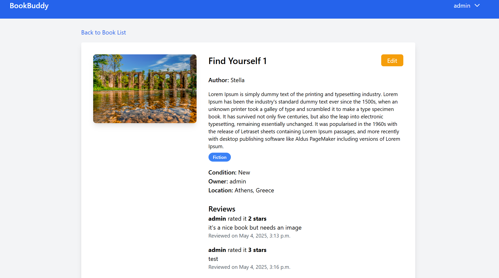
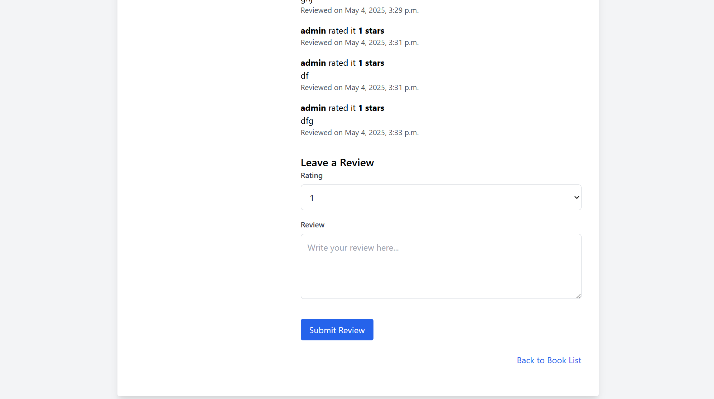
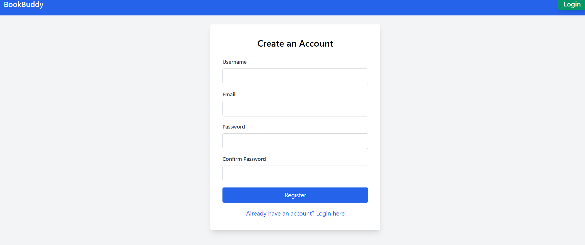

# BookBuddy

Η εφαρμογή που δημιουργήθηκε ονομάζεται BookBuddy. Είναι μια πλατφόρμα εύρεσης και ανταλλαγής βιβλίων χωρίς πληρωμή ή αγορά βιβλίων. Είναι μια διαδικτυακή πλατφόρμα που κάνει προσιτή και σύγχρονη την ανταλλαγή και τον δανεισμό βιβλίων μεταξυ των χρηστών της. 

Η εφαρμογή αυτή στοχεύει στην προώθηση της ανάγνωσης ως μορφή ψυχαγωγίας σε έναν κόσμο που η τεχνολογία τείνει να αποτελεί αντίπαλο του βιβλίου. Μέσω του BookBuddy o καθένας μπορεί να αναζητήσει, να προσφέρει ή να δανειστεί βιβλία χωρίς κόστος. 

Οι βασικοί χρήστες της πλατφόρμας είναι λάτρεις του βιβλίου, φοιτητές και κάτοικοι αστικών περιοχών, ανεξαρτήτως οικονομικής κατάστασης ή κοινωνικής τάξης. Είναι μια πλατφόρμα που προωθεί την κυκλική οικονομία και έχει φιλανθρωπικό και φιλικό προς το περιβάλλον χαρακτήρα. 

Απευθύνεται ακόμα σε άτομα που θέλουν να αποκτήσουν πρόσβαση σε πληθώρα τίτλων βιβλίων χωρίς να είναι αναγκασμένοι να αγοράσουν ή να ψάξουν κάποια κοντινή δανειστική βιβλιοθήκη. Η ανάγκη που καλύπτει η εφαρμογή αυτή ουσιαστικά είναι της ψυχαγωγίας μέσω της ανάγνωσης βιβλίων για ανθρώπους που δεν έχουν την οικονομική δυνατότητα να αγοράσουν νέα βιβλία ή υποστηρίζουν την ανακύκλωση βιβλίων και αντικειμένων και έχουν έντονη οικολογική συνείδηση. 

Η εφαρμογή παρέχει δυνατότητες αναζήτησης τίτλων, δυνατότητα καταχώρησης διαθέσιμων τίτλων προς δανεισμό, ανταλλαγής μηνυμάτων μεταξύ χρηστών και αξιολόγησης βιβλίων.

---

## Αναλυτική Περιγραφή και Τεκμηρίωση των Λειτουργιών

### Λειτουργία 1η: Συνδεση Χρήστη 

**Περιγραφή:**  
Ο  χρήστης συνδέεται στο λογαριασμό στο BookBuddy χρησιμοποιώντας το username και τον κωδικό του.

**Είσοδος:**  
Username και  password

**Έξοδος:**  
Ο χρήστης μεταφέρεται στην πλατφόρμα ως μέλος που μπορεί να στείλει μηνύματα και να ανεβάσει βιβλία.

**Mockup:**

### Λειτουργία 2η: Αναζήτηση Τίτλων

**Περιγραφή:**  
Ο χρήστης έχει τη δυνατότητα να κάνει αναζήτηση για κάποιο βιβλίο που ψάχνει με βάση τον τίτλο του βιβλίου ή την κατηγορία του.

**Είσοδος:**  
Τίτλος Βιβλίου, Συγγραφέας, Καταχωρημένες Κατηγορίες

**Έξοδος:**  
Λίστα με αποτελέσματα βιβλίων που ταιριάζουν με τα κριτήρια αναζήτησης.

**Mockup:**

---

### Λειτουργία 3η: Προβολή Λεπτομεριών Τίτλου Βιβλίου

**Περιγραφή:**  
Οι χρήστες μπορούν να δουν λέπτομερείες ,δηλαδή μια σχετικη περιγραφη του βιβλίου αλλά και σχολιασμούς άλλων χρηστών καθώς και στοιχεία για την κατάσταση του βιβλιου και του ιδιοκτήτη.

**Είσοδος:**  
Πάτημα στο κουμπί view details 

**Έξοδος:**  
Πλοήγη στο profile του τιτλου του βιβλίου.

**Mockup:**

### Λειτουργία 4η: Αξιολόγηση Βιβλίου

**Περιγραφή:**  
Οι χρήστες μπορούν να αφήσουν αξιολόγηση του βιβλίου που διάβασαν.

**Είσοδος:**  
Αξιολόγηση 1–5 Αστέρια, Σχόλιο (προαιρετικά)

**Έξοδος:**  
Η αξιολόγηση καταγράφεται κάτω στα details του βιβλίου.

**Mockup:**

### Λειτουργία 5η: Μηνύματα μεταξύ χρηστών

**Περιγραφή:**  
Οι εγγεγραμμένοι χρήστες μπορούν να ανταλλάξουν μηνύματα έτσι ώστε να βρουν τρόπο συνάντησης για την ανταλλαγή ή τον δανεισμό βιβλίου.

**Είσοδος:**  
Κλικ στο κουμπί "Contact Owner"

**Έξοδος:**  
Εμφανίζεται συνομιλία με τον ιδιοκτήτη του βιβλίου.

### Λειτουργία 6η: Εγγραφή Χρήστη 

**Περιγραφή:**  
Ο νέος χρήστης δημιουργεί λογαριασμό στο BookBuddy χρησιμοποιώντας το email του και δημιουργώντας ένα username και έναν κωδικό.

**Είσοδος:**  
Username, email, password

**Έξοδος:**  
Ο νέος χρήστης δημιουργεί λογαριασμό και μπορεί να ανεβάζει τα δικά του βιβλία , να σχολιάζει σε τίτλους και να ανταλλάσει μηνύματα.

**Mockup:**

 
---

### Σχήμα Βάσης Δεδομένων
**Διευκρινήσεις:**  
Στο σχήμα φαινεταί το Profile το οποίο είναι υπο υλοποίηση. Είναι ενά συνολικο σχήμα για καλύτερη κατανόηση της τελικής λειτουργίας του site.

[Σχήμα βασης δεδομενων ](https://www.canva.com/design/DAGmfqO_faw/M2dPL7utAl4b7H8vTi8tNg/view?utm_content=DAGmfqO_faw&utm_campaign=designshare&utm_medium=link2&utm_source=uniquelinks&utlId=h5446adf6aa)
